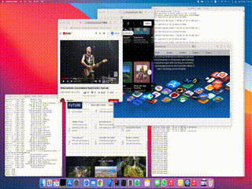

# ReMag
Mac window manager, which can organize and manage windows, save screen templates, where you can save not only the position and size of windows, but also the application that should be in each place, so that you can launch all the necessary applications in the desired order on the screen in one click
 

  

